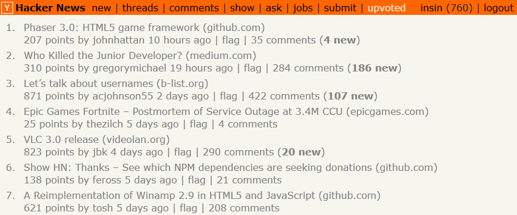
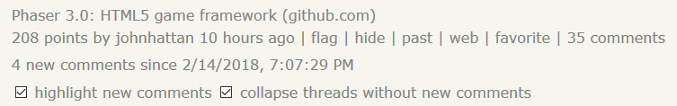

# User Scripts

User scripts for sites I tend to use a lot, usually to enhance repeat visits by reducing the amount of junk I need to scroll through.

These should be compatible with all the main [user script managers](https://greasyfork.org/en#home-step-1).

## [Hacker News Comment Trees](https://greasyfork.org/en/scripts/18066-hn-comment-trees)

Makes it possible to actually follow conversations and new comments on repeat visits to [Hacker News](https://news.ycombinator.com/).

The number of comments on previously visited stories is displayed on story list pages.

Controls are added to the story header when there are new comments.

When you revisit a story page by clicking on its new comment count, new comments will automatically be highlighted and threads without new comments will be collapsed.

Other minor tweaks:

- An "upvoted" link is always included in the header bar to make it easier to revisit upvoted stories
- The default collapse control on the right of each comment is replaced with a collapse control on the left hand side.

## MIT Licensed
